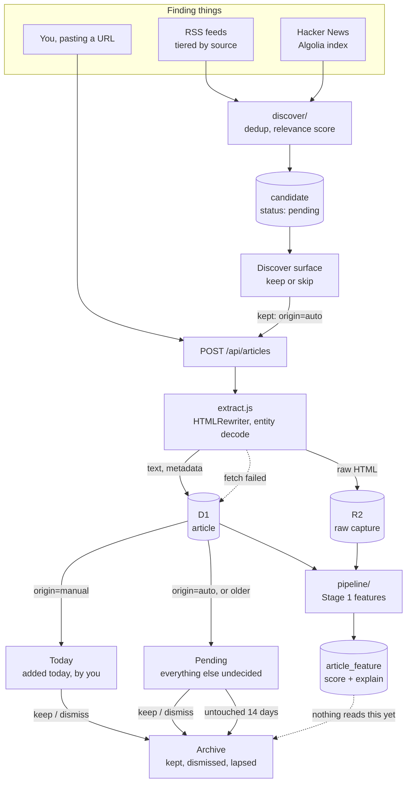
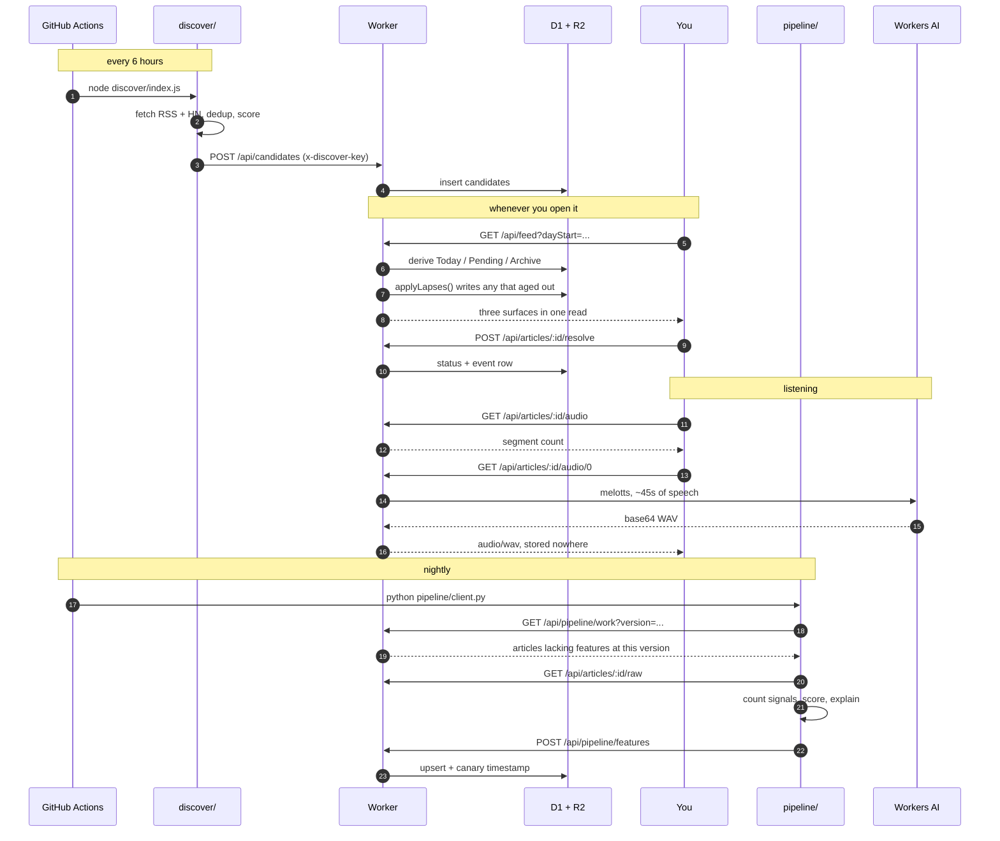

# NeatInfo — how the whole thing fits together

Two views: where articles come from and where they go, and what happens on an
ordinary day. Component-level diagrams live beside each component's README.

## The flow

Everything an article does, from being found to being archived.

The dashed line to the archive is deliberate. §8's first rule is that **the
score sorts, it never filters** — features are computed and stored, and nothing
in the app acts on them until Stage 5 has established they are worth acting on.

## An ordinary day

Who calls whom, and when.

Two things the sequence makes obvious that prose does not:

**The Worker never schedules anything.** Lapsing happens inside a feed read;
discovery and the feature pass are driven from outside. There is no cron in the
Worker at all, which is why there is no overnight job to fail silently.

**Audio is never stored.** The Worker generates a segment and forgets it. At
88 KB per second of speech, caching a long article would be 252 MB — and §9.7
says not to hoard what is expensive and reproducible.
