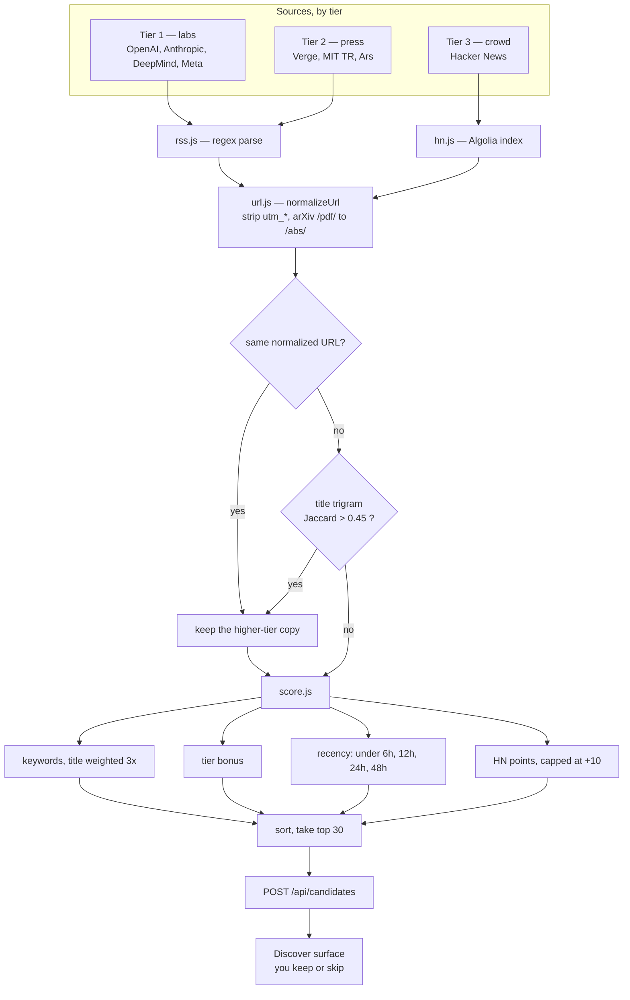
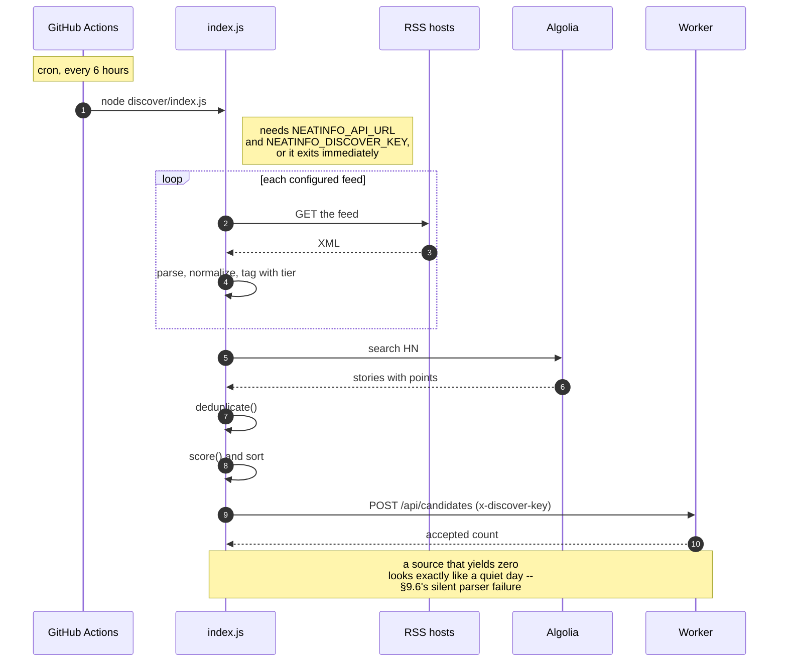

# discover/ — diagrams

## The funnel

Many candidates in, a reviewable few out.

**Deduplication is the step that earns its place.** Without it, one big story
arrives as five items from five outlets and the day's batch is a single piece
of news wearing five hats. Exact URL catches syndication; title similarity
catches the same story written five ways.

This scores **relevance** — is it worth looking at — not quality. That is
`pipeline/`, which runs later on the full text.

## A run

That last note is the failure mode to design against. A feed changing shape
produces no error, just fewer candidates, and it stays invisible until someone
notices the board is thin. If a source stops contributing, suspect the parser
before suspecting the world.
