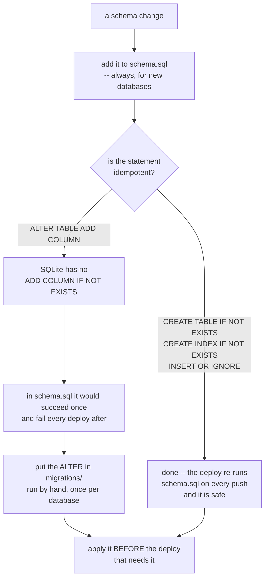
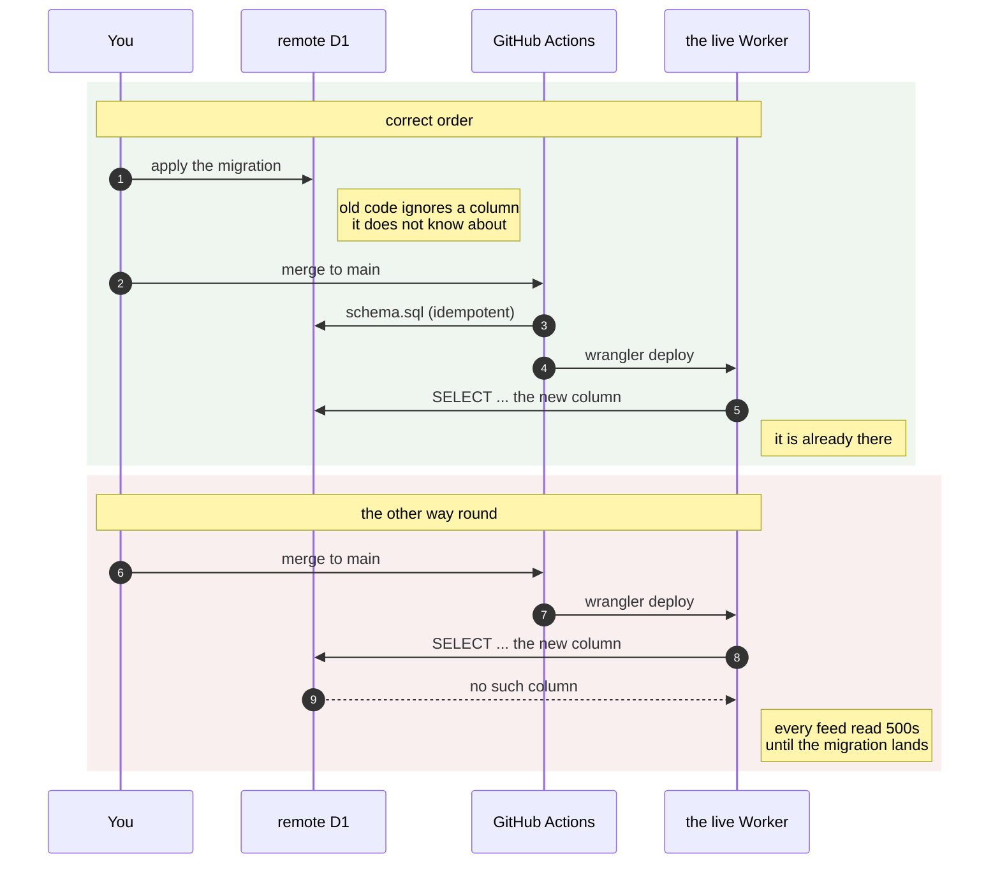

# migrations/ — diagrams

## Where does a schema change go?

## Why the order is that way round

Applying first is safe in both directions: the currently-deployed code is
unaffected by a column it never mentions. Applying second leaves a window where
production is broken, and the length of that window is however long it takes
you to notice.

| File | Adds | Idempotent | Run by hand |
|---|---|---|---|
| `0001-article-origin.sql` | `article.origin` | No — `ALTER` | Yes, local and remote |
| `0002-article-feature.sql` | `article_feature` | Yes | Local only; the deploy handles remote |
