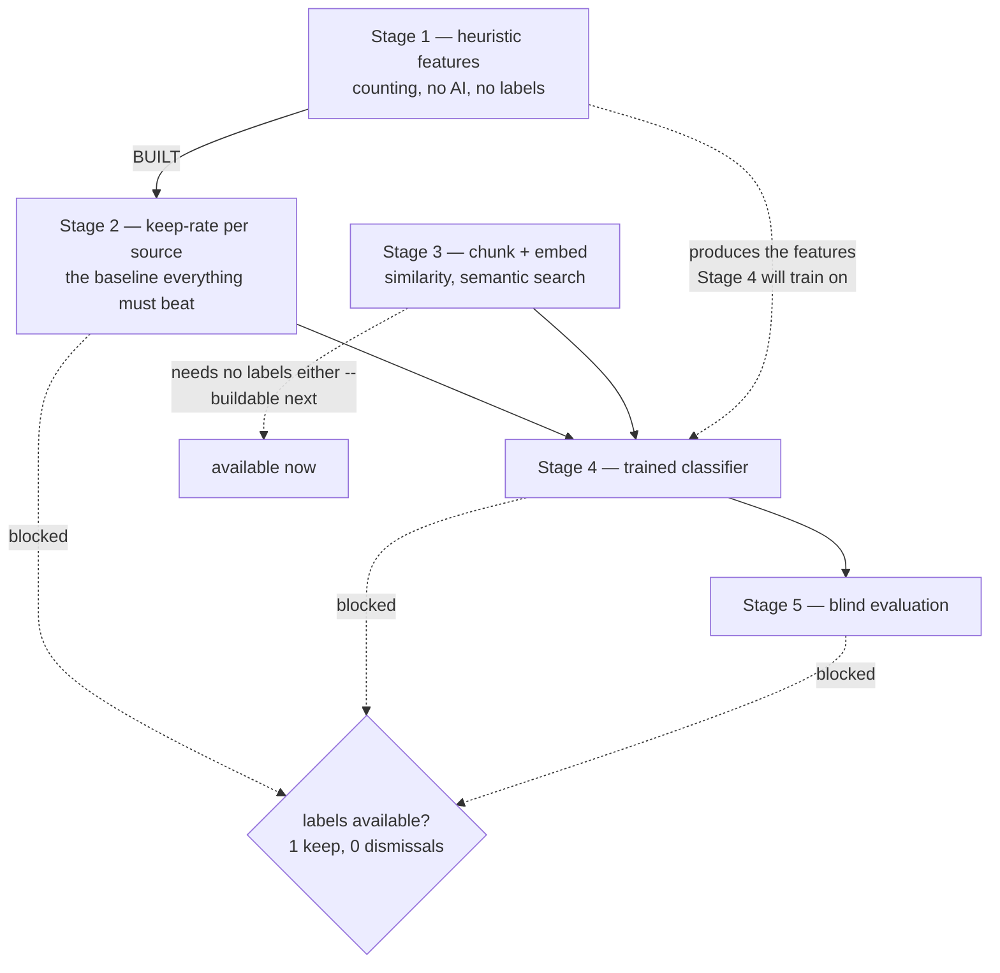
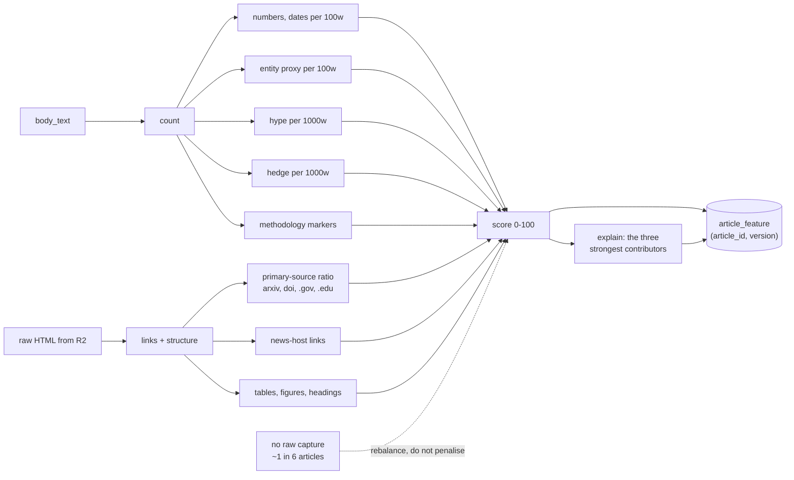
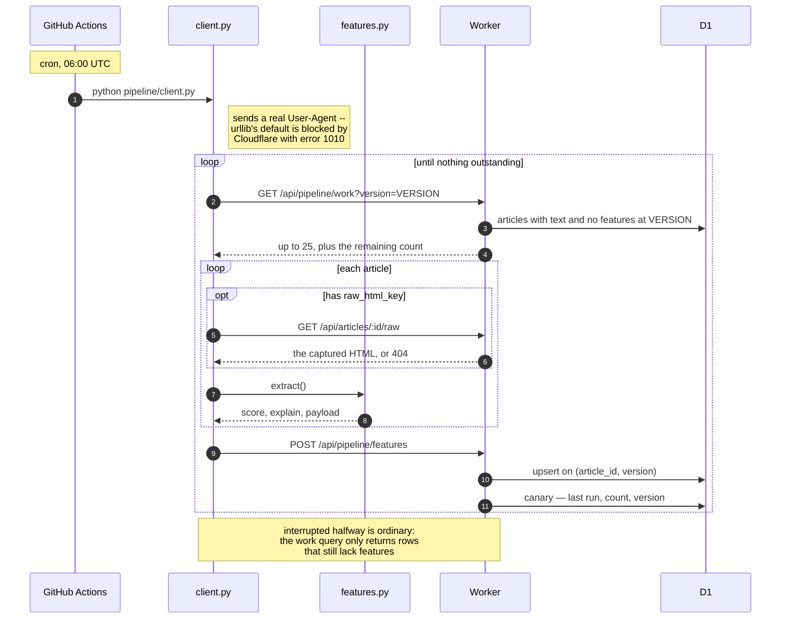

# pipeline/ — diagrams

## Where Stage 1 sits

The ladder from §8, and why only one rung is currently reachable.

The report ordered these 1→2→3→4→5 and that ordering is wrong for this project
today: Stages 2, 4 and 5 all learn from keep/dismiss decisions, and there is
one keep. Stage 1 and Stage 3 need no labels at all.

## What one feature pass does

An article whose page returned 403 has no capture. Scoring it as "zero primary
sources" would rank it down for a failure of our plumbing rather than of its
writing, so the score is rebalanced onto what is known and the row records that
it was.

## The nightly run

**Idempotence is structural, not defensive.** The Worker hands out only
articles missing features at this version, so a killed runner leaves the rest
outstanding and a re-run is a no-op. Bumping `VERSION` re-scores the corpus
into new rows without anything having to track staleness — and without
overwriting scores produced by different arithmetic, which Stage 5 will need to
compare.
