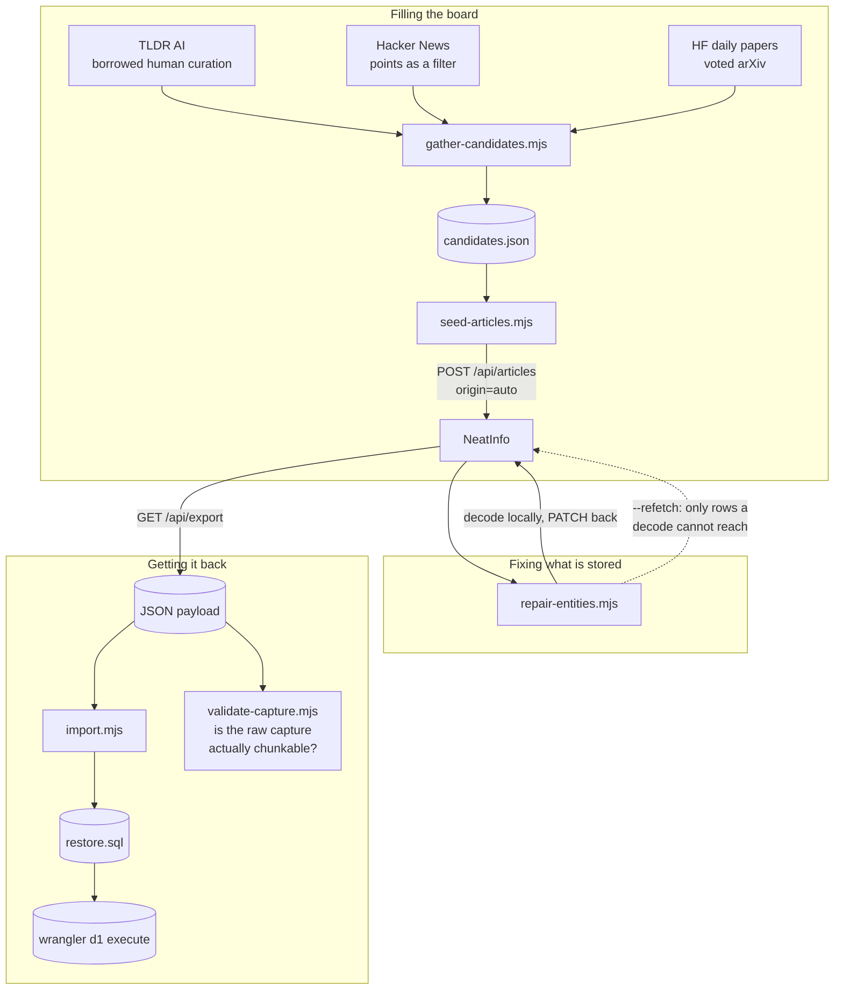
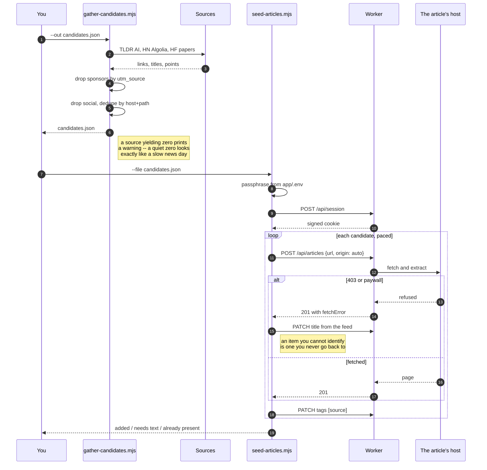

# scripts/ — diagrams

## What each one is for

Four tools, three jobs: fill the board, fix what is stored, get the data back.

Seeding goes through `POST /api/articles` rather than inserting into D1, so
extraction, the arXiv slice, duplicate detection, the body cap and raw capture
all behave exactly as they do for a hand-pasted link. **A bulk load cannot
create rows the app could not have created itself.**

## Seeding, step by step

`origin: 'auto'` is what puts fifty links in **Pending** rather than on Today.
Dumping them onto Today would destroy the one property that page has — being
short enough to finish.

Re-running over the same file is safe: the duplicate guard answers 409 and the
script counts it as *already present* rather than adding anything twice.
