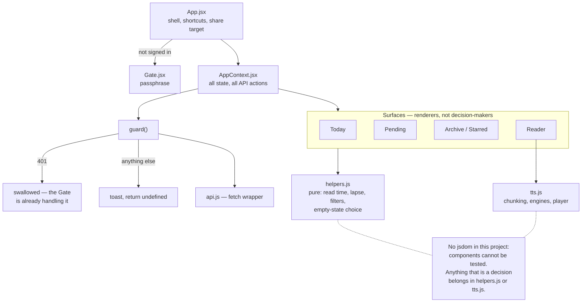

# src/ — diagrams

## State and where decisions live

Every arrow into the API goes through one place.



That last box is the reason the frontend is shaped this way. A decision inside
a component is a decision no test can reach, so "which empty message does
Archive show" and "which speech engine does this article get" are exported
functions that `test/` calls directly.

## Pressing play

The one interaction with real branching, and three of its steps are iOS
requirements rather than preferences.

```mermaid
sequenceDiagram
    autonumber
    participant You
    participant TP as TtsPlayer
    participant CE as chooseEngine
    participant S as workersAudioEngine
    participant W as Worker
    participant P as player
    participant WS as webSpeechEngine

    You->>TP: click play
    TP->>CE: articleId, api
    CE->>S: unlock()
    Note right of S: play() a silent moment INSIDE the<br/>click — Safari's activation does not<br/>survive an awaited fetch
    CE->>S: prepare()
    S->>W: GET /api/articles/:id/audio
    W-->>S: segments + per-segment sizes

    alt server audio available
        CE-->>TP: engine = server, voice = "generated"
        TP->>P: setEngine(server) — same player object
        P->>S: speak(segment 0)
        S->>W: GET /audio/0
        W-->>S: audio/wav
        Note right of S: one reused <audio> element;<br/>segment 1 prefetched while 0 plays
        S-->>P: onended -> next segment
    else too long, no AI, day's limit, or it threw
        CE-->>TP: engine = device, voice = "device"
        TP->>P: setEngine(webSpeech)
        P->>WS: speak(chunk)
        Note right of WS: resume() every 10s —<br/>Chrome stops after ~15s of<br/>total speaking time
    end

    alt a segment fails mid-article
        S-->>TP: onError
        TP->>P: setEngine(webSpeech), re-speak
        Note over TP: falls back rather than<br/>restarting from segment 0
    end
```

The player is **one object for the life of the app** and swaps its engine.
Minting a new player per engine meant `AppContext`'s `getPlayer().stop()`, the
component's copy and the live player could be three different objects — so
closing the reader mid-generation left an article talking with no UI.
