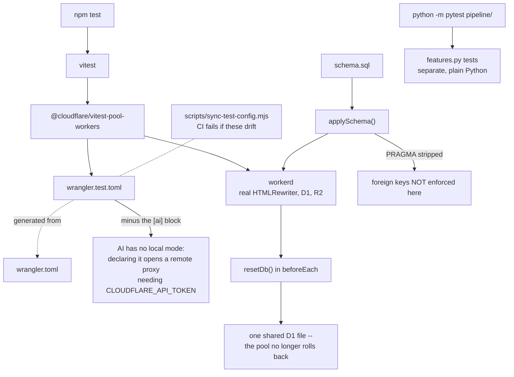
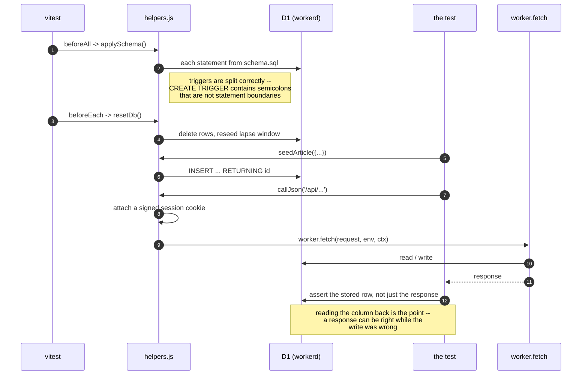
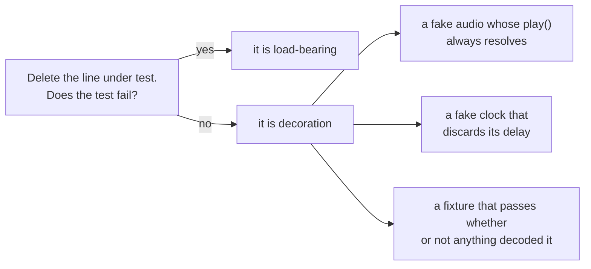

# test/ — diagrams

## How the harness is put together

The two surprises are on that diagram: **storage is shared**, so a test passing
alone and failing in the suite is almost always a missing `resetDb()`; and
**`PRAGMA` is stripped**, so foreign keys are not enforced — never assert
behaviour that depends on them, because that is a property of the environment
rather than of the code.

## One test's life

## The question to ask of any test here

All three of those are real, from this codebase, and each hid a bug that
reached review. The fakes now reject, report `NaN` duration, record their
delays, and the entity fixture is double-escaped so it fails if nothing decoded
**and** if something decoded twice.
