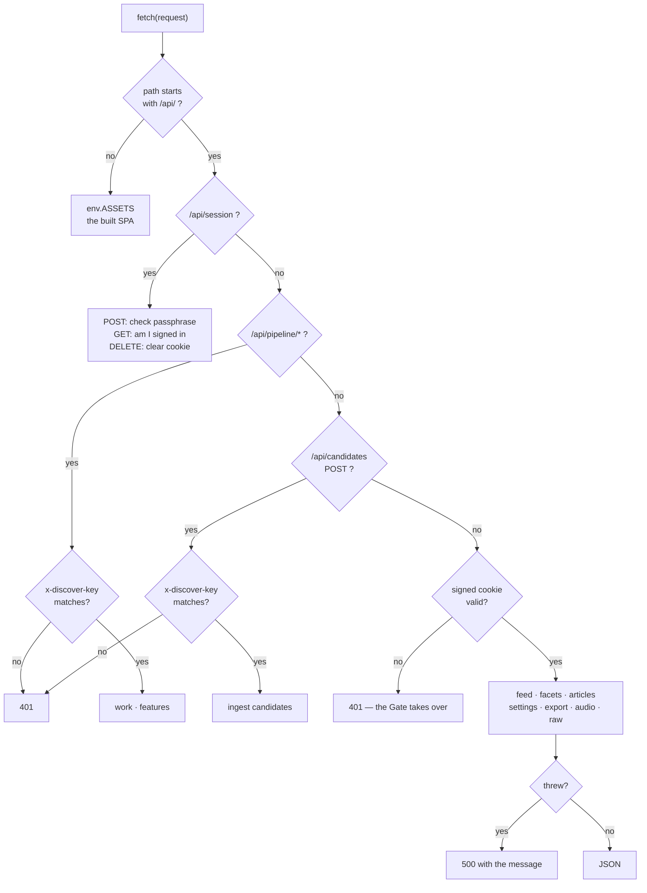
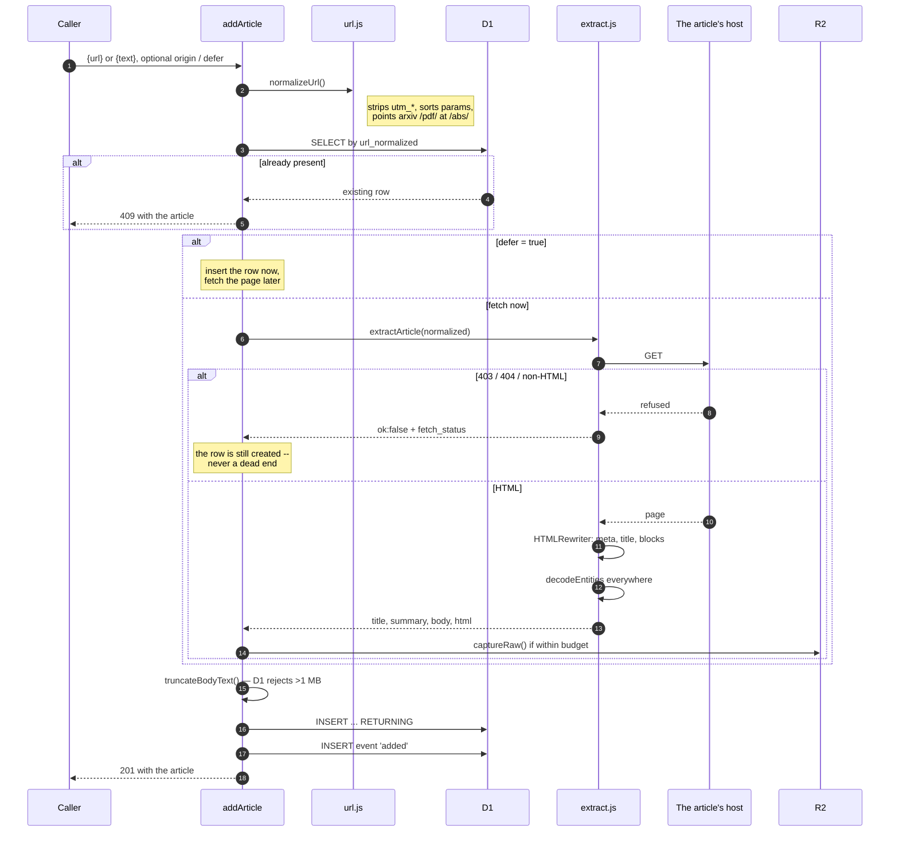

# worker/ — diagrams

## Request routing

Everything that arrives, and the two gates it can pass through.

Two auth schemes on purpose: a **person** gets a session cookie, a **machine**
gets `x-discover-key`. A pipeline key cannot read your archive as you, and the
machine routes are checked before the cookie gate rather than after, so they
never depend on a session existing.

## Ingest, step by step

`POST /api/articles` — the most consequential procedure in the file.

The branch that matters is the failed fetch: it still creates a row. A login
wall or a dead host leaves an article with a URL, a `fetch_status` and a paste
box — §3's rule that the app is never a dead end applies *after* ingest too.
